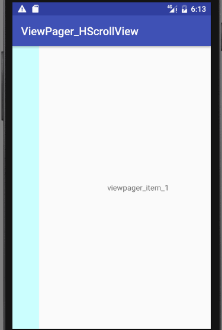

## ViewPager_HScrollView
HorizontalScrollView嵌套ViewPager时，ViewPager的滑动失效，默认只有HorizontalScrollView的滑动有效。效果如下： 
 
解决这种问题可以自定义ViewPager，在ViewPager的dispatchTouchEvent（MotionEvent e）方法中进行设置，主要方法实现如下: 
`public boolean dispatchTouchEvent(MotionEvent ev) {
        curP.x = ev.getX();
        curP.y = ev.getY();
        if (ev.getAction() == MotionEvent.ACTION_DOWN) {
            // 记录按下时候的坐标
            downP.x = ev.getX();
            downP.y = ev.getY();
            getParent().requestDisallowInterceptTouchEvent(true);
            mItemIndex = getCurrentItem();
        }
        if (ev.getAction() == MotionEvent.ACTION_MOVE) {
            // 此句代码是为了通知他的父View现在进行的不是本控件的操作，父View可以拦截事件
          if (Math.abs(curP.y - downP.y) > 120) {
                getParent().requestDisallowInterceptTouchEvent(false);
            } else {
                if (mItemIndex == 0) {
                    if (curP.x < downP.x) {//向左滑动
                        getParent().requestDisallowInterceptTouchEvent(true);
                    } else {//向右滑动
                        getParent().requestDisallowInterceptTouchEvent(false);
                    }
                } else {
                    getParent().requestDisallowInterceptTouchEvent(true);
                }
            }
        }
        return super.dispatchTouchEvent(ev);
    }
